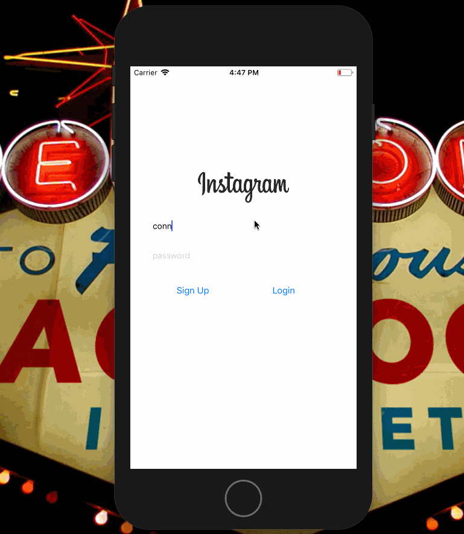
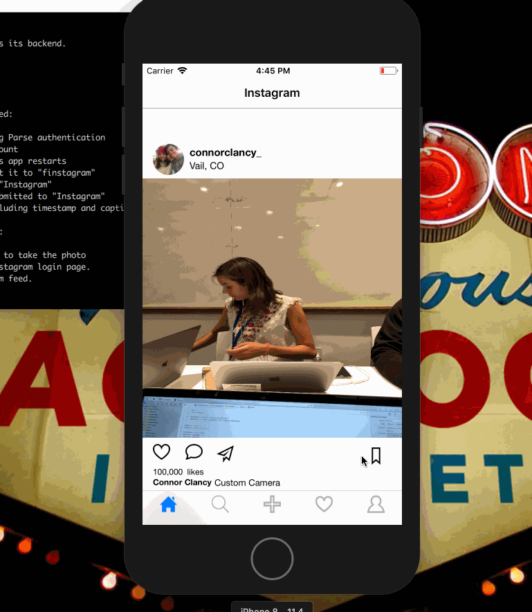
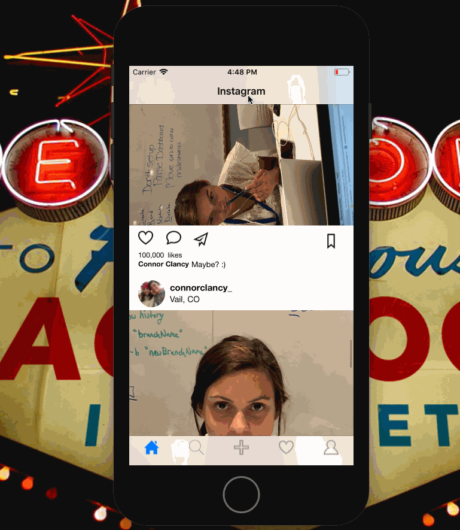
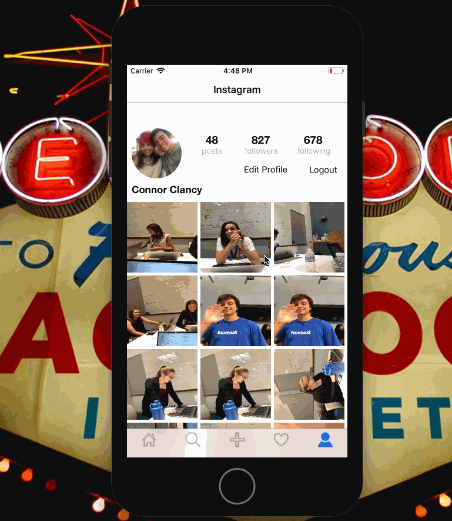
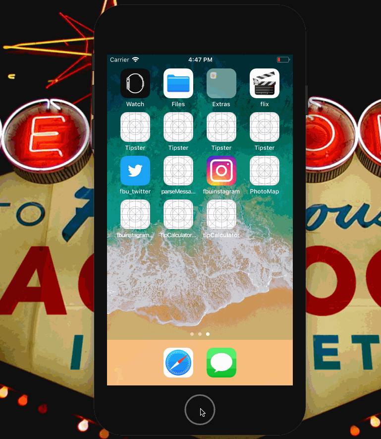

# Project 4 - Finstagram

**Finstagram** is a photo sharing app using Parse as its backend.

Time spent: **8** hours spent in total

## User Stories

The following **required** functionality is completed:

- [y] User can sign up to create a new account using Parse authentication
- [y] User can log in and log out of his or her account
- [y] The current signed in user is persisted across app restarts
- [y] User can take a photo, add a caption, and post it to "finstagram"
- [y] User can view the last 20 posts submitted to "Instagram"
- [y] User can pull to refresh the last 20 posts submitted to "Instagram"
- [y] User can tap a post to view post details, including timestamp and caption.
	time can be added with a label but I didn't like the view - the code is in my file DetailsViewController to get the timestamp

The following **optional** features are implemented:

- [y] Run your app on your phone and use the camera to take the photo
- [y] Style the login page to look like the real Instagram login page.
- [y] Style the feed to look like the real Instagram feed.
- [y] User can use a tab bar to switch between all "Instagram" posts and posts published only by the user. AKA, tabs for Home Feed and Profile
- [n] User can load more posts once he or she reaches the bottom of the feed using infinite scrolling. 
Would have done same as the twitter, keeping an index of how many to load and where to load from.
- [n] Show the username and creation time for each post
Would create a new model for the dicitonary for the user, in the user I would store his username, prof picture and liked images. For the creation time of the post I would access the post.createdAt attribute and add a label on the view
- [n] After the user submits a new post, show a progress HUD while the post is being uploaded to Parse: I would do this the same as I did for flix where I start animating the progress hud when I start the request and stop animating in the completion block after all updates.
- User Profiles:
   - [n] Allow the logged in user to add a profile photo
	On the user home page under edit profile I would allow them to upload a 	photo and I would do this in the same way we did the photos for the post 	except I would save the image explicitly in the user object.
   - [n] Display the profile photo with each post
	In my current profile picture section I would set the profile image PFIM	ageView to self.User.profilePicture (an attribute I would add to the use	r model"
   - [n] Tapping on a post's username or profile photo goes to that user's profile page
	I would do this the same as I did for twitter, setting a gesture recogni	zer and then using the tapped posts user attribute to segue and populate 	a user page
- [n] User can comment on a post and see all comments for each post in the post details screen.
	I would add a property to the Post model of an NSArray called comments
	Then when a user wanted to post a commment on a picture I would send
	a push request where update the array with the new comment, I would also 	do this locally. Then I would reload the data. Comments would be in a n		ew view as a table view.
- [n] User can like a post and see number of likes for each post in the post details screen.
	I would add a liked by property to the Post model. I would create functins "liked" and "disliked" which would handel the array of users which liked a post.
- [y] Implement a custom camera view.

The following **additional** features are implemented:

- [ ] Check tip calculator without storyboard did
  - created views programatically
  - did autolayout programatically
  - created unit tests for finstagram
  - created UI tests for instagram

Please list two areas of the assignment you'd like to **discuss further with your peers** during the next class (examples include better ways to implement something, how to extend your app in certain ways, etc):

1. view controllers programatically
2. code organization

## Video Walkthrough

Here's a walkthrough of implemented user stories:

The custom camera view and posting are the video file that is in the directory.

GIF created with [LiceCap](http://www.cockos.com/licecap/).

## Credits

List an 3rd party libraries, icons, graphics, or other assets you used in your app.

- [AFNetworking](https://github.com/AFNetworking/AFNetworking) - networking task library

## Notes

Describe any challenges encountered while building the app.
I didn't run into many problems when making the instagram app but did learn a lot while implementing views programmatically and I struggled figuring out how to test the async calls and api calls done but learned how to.

Choosing to continue on the instagram app I also would have had the labels display highlighed if gthey had liked a post and have this persist through user sessions. I would do this by binary searching through the users "Liked" property which would contain the post ids  and if a user had liked a displayed post the liked label would be set to selected.

## License

    Copyright [2018] [Connor Clancy]

    Licensed under the Apache License, Version 2.0 (the "License");
    you may not use this file except in compliance with the License.
    You may obtain a copy of the License at

        http://www.apache.org/licenses/LICENSE-2.0

    Unless required by applicable law or agreed to in writing, software
    distributed under the License is distributed on an "AS IS" BASIS,
    WITHOUT WARRANTIES OR CONDITIONS OF ANY KIND, either express or implied.
    See the License for the specific language governing permissions and
    gimitations under the License.
